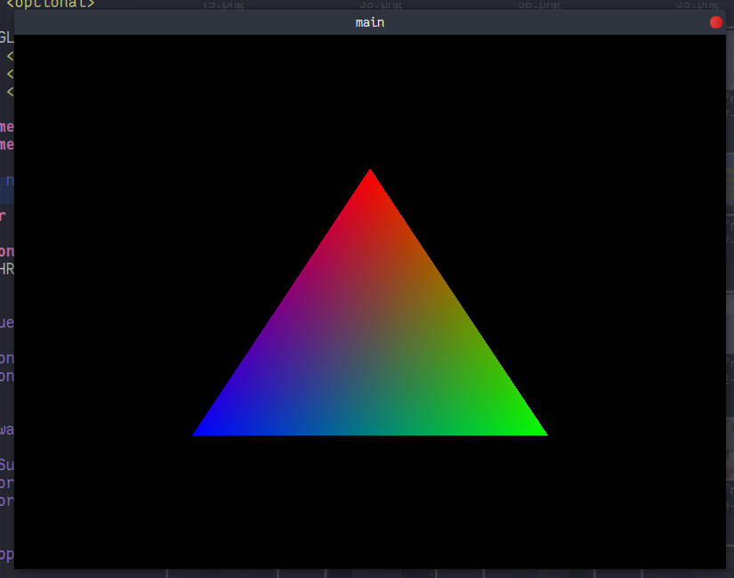

# Dear Vulkan

* C++17 required
* Vulkan with C++ bindings required
* Glfw3 required
* glsl -> SPIR-V compiler required

## Build 

```bash
$ cmake . -Bbuild
$ cmake --build build
```

## Shader Precompile

```bash
$ glslangValidator resources/main.fs -V -o build/fs.spv
$ glslangValidator resources/main.vs -V -o build/vs.spv
```

## Excecute

```bash
$ cd build && ./main
```

**Finally you get a stupid triangle like this**


